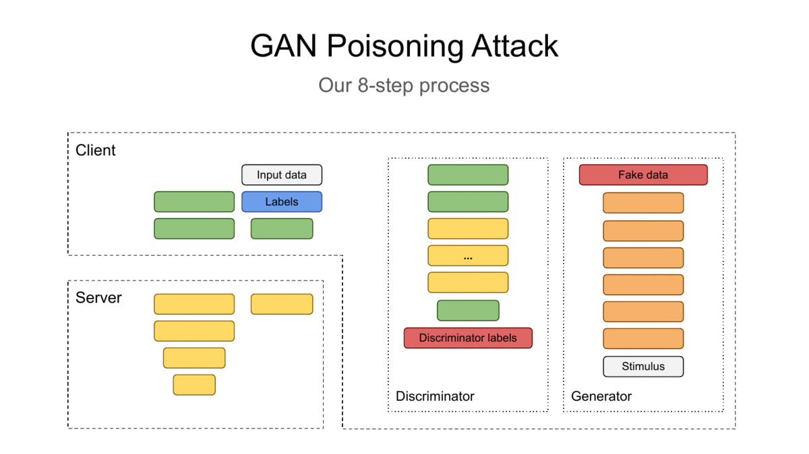
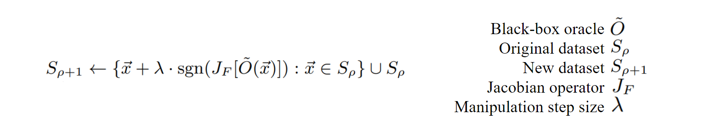
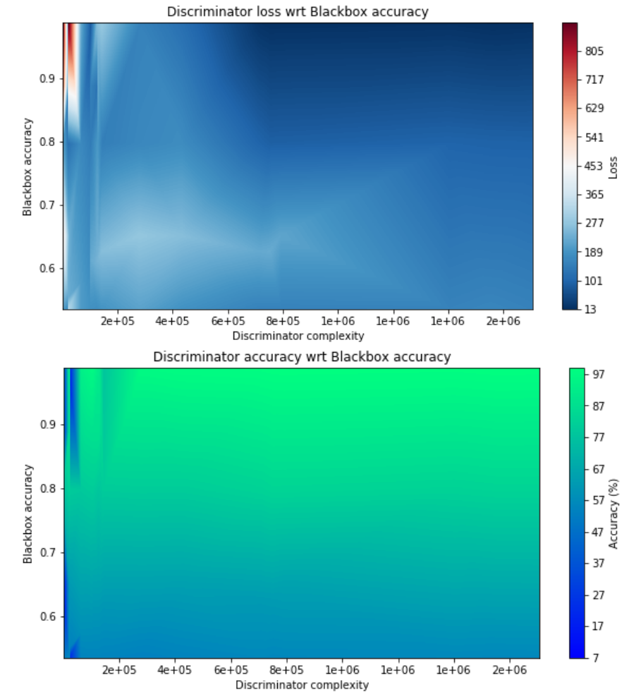
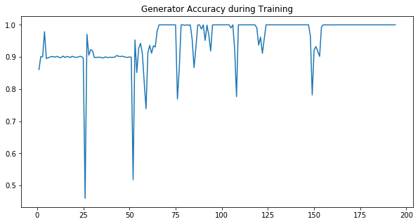

# Investigating the Vulnerabilities of Split Learning

<!-- # Header 1
## Header 2
### Header 3
#### Header 4
##### Header 5
###### Header 6 -->

### Authors
* Zach Harris: UCLA, M.S. in ECE, _jzharris@g.ucla.edu_
* Hamza Khan: UCLA, M.S. in ECE, _hamzakhan@g.ucla.edu_

### Abstract
As big data analytics becomes rooted in critical fields such as health, finance, economics, and politics,
the privacy and integrity of the training data must be upheld. For example, health information from patients is confidential
and must abide by patient confidentiality agreements. This information can still be used to collaboratively train a 
deep learning model while maintaining privacy through methods such as Federated Learning. 
Federated Learning, however, has been shown to expose backdoors which make the data liable
to undetectable data retrieval and model poisoning attacks during training. A recent method called Split 
Learning claims to provide a secure way of collaboratively training deep learning models. The vulnerabilities of this
method have not been fully investigated, however. In this work, we first present vulnerabilities of Federated Learning 
involving raw data retrieval and input data poisoning [[1-2]](#1), focussing on 
label poisoning attacks [[3-5]](#3) and backdoor attacks [[6-7]](#6). 
Secondly, introduce Split Learning [[8-15]](#8) and investigate its susceptibility to label poisoning and backdoor attacks. Finally, we introduce an attack pipeline consiting of a Generative Adversarial Network (GAN) and apply black-box attack techniques to the pipeline to improve upon the attack's success.

## I. Introduction

<!-- TODO: give an overarching view of Split Learning, and some examples for what ways Split Learning is secure. Mention Federated Learning and draw connections between FL and SL. -->

## II. Background

### A. Standard Approaches to Distributed Deep Learning

##### Federated Learning

##### Large Batch Synchronous SGD

### B. Split Learning

##### Methods

##### Security Benefits

### C. Generative Adversarial Networks (GANs)

<!-- ## Overall Project Goals -->
## III. Motivation

### A. What we are doing

Investigating data privacy and model poisoning vulnerabilities for systems using the Split Learning paradigm to train a shared model.

We are investigating the data privacy and model poisoning vulnerabilities for systems using the Split Learning paradigm to collaboratively train models. We are mounting a label poisoning attack on a class of the model that is kept private to us. For example, let us assume that a Split Learning model is being trained to predict MNIST digits and an attacker is training the model to increase the accuracy of the model on the '0' class. Let us assume that the attacker seeks to poison the '1' class of the model. We speculate three reasons why it is plausible for an attacker to target a particular class of the model, when they don't know the data behind that class:

1. They have deduced that one of the clients they wish to attack may have the '1' class. In this case, the attacker does not know what data is present in the '1' class, however they wish to reduce the accuracy of the portion of the model that their targetted client is training.
2. Instead of focussing on a particular client, the attacker is trying to optimize the potency of their attack on the model over all classes. For example, perhaps the attacker realizes that there is an increased potency in their attack when they mislabel images from the '1' class as being from the '7' class, but a decreased potency when they mislabel images from the '8' class as the '7' class. There is therefore a better chance for their attack to work by choosing to poison the '1' class over the '8' class.
3. The attacker could have chosen this class arbitrarily. They could be trying to negatively impact the accuracy of any of the victim classes while preserving the accuracy of their own class.

### B. Why it is important

Split Learning has made specific claims [[9]](#9) that gives the training pipeline an extra edge in security over other collaborative training methods such as Federated Learning.

Their first claim is that the training data of disjoint clients cannot be accessed by one another, and a client's dataset is garaunteed to be secure regardless of the number of malicious clients present. This claim stems from the fact that the client's dataset never leaves their local system: the only information shared by the client's machine are the activations of the last client-side layer. The client-side layers introduce noise and perform nonlinear operations on the original input data. The information sent to the server is therefore not the client's raw data, but can be thought of as a cipher calculated by the client's private layers. [[TODO]]() The cipher is weak because these client-side layers are shared amongst clients, which means that a maliscious client can recover the private data if they intercepted the victim client's transmission. However, since we are dealing with client-server communication, the transmission can be encrypted using public key encryption [[TODO]](). However, an attacker outside of the Split Learning process would not be able to derive the client's dataset regardless of extra encyption. Split Learning therefore easily mitigates snooping attacks and keeps all of the client's data private.

Their second claim is that malicious client attacks are mitigated since a portion of the shared model is off-limits to all clients. Zhang, Jiale, et al. [[3]](#3) showed that the private datasets of clients can be approximated when all clients have access to the model while it is training. Their work involved using a GAN to implement a label poisoning attack where the GAN's Discriminator model was replaced with the public model. By doing so, the GAN's generator was able to generate a convincing approximation of all classes that the attacker did not have access to. In order to mitigate this vulnerability, Split Learning keeps a portion of the model off-limits to the clients. This way, it is incredibly difficult to mount an attack using a GAN like before, because most of the model is now unkown to the attacker.

### C. How it is done today

No previous work has shown the vulnerabilities of Split Learning. Gupta et al. [[9]](#9) mention their future work will be to investigate vulnerable aspects to Split Learning. We have performed this work in order to help in the investigation. Because no prior work has mounted an attack on Split Learning, we extend present state-of-the-art methods to perform an attack. First, we simulate the Split Learning pipeline from [[9]](#9). Second, we incorporate the GAN attack from [[3]](#3). Finally, we improve our new pipeline with black-box attacks such as FGSM [[21-23]](#21) and advGAN [[20]](#20). We decided to test the aspects of these two methods in particular by comparing the performance of different black-box attack attempts on the MNIST dataset in the MIT _MNIST Adversarial Examples Challenge_ [[18]](#18).

### D. Specific Aims

In this work, we aim to accomplish the following five goals.

##### 1. Gather statistics for performing label poisoning attacks

In order to perform label poisoning on Split Learning, we must develop a testbed where we can strengthen our label poisoning attacks.

##### 2. Simulate the Split Learning method

To perform label poisoning on Split Learning, we also must simulate the Split Learning method. In order to shorten training times and have complete control over every step in the Split Learning method, we train the black-box model on the same machine as the client's GAN model. We require for our simulation to provide the ability to vary the number of clients and attackers.

##### 3. Approximate Split Learning’s black-box model

The server-side black-box model must be approximated as quickly and accurately as possible. However, the initial Discriminator is initialized with random weights and is very far from the black-box model. We require a system that will maximize the Generator's output success rate on the Discriminator and a black-box attack system that will query the black-box with images that cause the Discriminator to quickly approach the black-box.

##### 4. Evaluate vulnerability of Split Learning to a label poisoning attack

In order to mount a label poisoning attack on a Split Learning system using a GAN, we must first determine how feasible it is to conduct label poisoning on Split Learning using compromised clients. Our aim is to show that Split Learning can be poisoned using label poisoning via backdoors we create in our simulation.

##### 5. Evaluate vulnerability of Split Learning to a data estimation attack

Finally, we must implement the black-box and data estimation scheme in a coordinated label poisoning attack. In order to evaluate the vulnerability of Split Learning to this method, we will present both aggregated and individual attack results.

<!-- ## Technical Approach -->
## IV. Methods

### A. Label Poisoning Attack

### B. GAN Poisoning Attack

In order to perform a label poisoning attack on a real Split Learning system, we require knowledge of the other clients' private datasets. For the following example, consider that an attacker represents 5% of the '0' class and desires to hinder the 100 clients responsible for training the '1' class.

The attacker will train the GAN while pretending to be a normal client, contributing to the training of the black-box model by performing backpropagation on their '0' dataset and submitting the updated gradients to the server. The server accumulates clients on a timed schedule, resulting in 20 clients' gradient updates being accumulated every time using large batch synchronous SGD [[TODO]]().

As the attacker trains equitably, their GAN will learn features from the other clients’ private datasets. Once the attacker is satisfied with the convergence of their GAN on the '1' class, they will use the images generated from the Generator of the GAN in a label poisoning attack to reduce the accuracy for that class.

In order to accomplish this attack, we implement an 8-step training process. During this process the system is iteratively optimized by refining the Generator, querying the black-box, and refining the Discriminator.

<!-- Looking back: a potential mitigation is to have a strict schedule for accumulating batches between clients. ALTHOUGH, this could still be thwarted if the attacker had control of multiple clients. -->

##### The 8-step process

The above gif animates our 8-step process. This process is an extended version of the GAN poisoning attack performed by Zhang, Jiale, et al. [[3]](#3). We extend their method to account for querying the black-box model. The following steps are performed in order:

1. Pretend to be a normal client, training on the ‘0’ class.
2. Simultaneously train GAN to generate fake data. Repeat steps 1 and 2 until there is no further improvement that can be made to the Generator. In other words, until the Discriminator consistently marks the images from the Generator as indistinguishable from fake images.
3. Use the optimized Generator to shuffle the fake data into the attacking client's normal training batch. This new batch of images is sent into the Split Learning model. The model returns the responses, and the labels from the fake data are removed and set aside.
4. Perform a normal backpropagation step on the remaining labels. The query that the attacker made goes undetected because the server receives the same training pattern as a benign client.
5. Generate a label from the Discriminator for each image generated by the Generator in step 3. The lables from the Discriminator are compared to the labels queried from the black-box. We use MSE to measure the difference between the labels. The Discriminator is refined to better match the black-box during future queries.
6. Repeat steps 1 through 5 until data from the targetted class emerges.
7. Send a batch of generated images into the Split Learning model.
8. Perform backpropagation on the batch sent to the Split Learning model, however flip the labels accordingly to mount a label poisoning attack on the targetted class.

### C. GAN System Verification

Before commencing a full-blown GAN poisoning attack, we will first verify that we can produce private data from other clients, given the black-box is known to the attacker. We perform the same 8-step process as above, however we clone the black-box model and use the clone as the Discriminator. The weights are shared throughout the training of the black-box. We know that if the GAN cannot generate valid attack images for all classes in the system when the black-box model is known to us, then it certainly cannot generate valid attack images when the black-box is kept secret.

### D. Black-box Attack

To improve the results of the GAN poisoning attack, we will query the black-box model with inputs designed to speed up Discriminator training. The Generator optimizes its output on the Discriminator. The Discriminator refines its output to closer match the black-box. However, the output from the black-box relies on the images provided by the Generator. Because of this recursive connection, the GAN training paradigm as-is presents a "Chicken and Egg" strategy problem. The training of this system converges very slowly because the Discriminator can only refine itself using _negative_ cases (in any other GAN training scheme, the Discriminator can use positive cases during training). 

Therefore, optimizing the Discriminator refinement process is congruent to optimizing the queries sent to the black-box. Black-box attack techniques provide this capability. We selected the two highest-performant techniques from MIT’s MNIST Adversarial Examples Challenge [[18]](#18), namely Fast Gradient Sign Method (FGSM) [[21-23]](#21) and advGAN [[20]](#20).

##### FGSM

##### advGAN

## V. Implementation

### A. Split Learning simulation

We used Tensorflow v2 with Keras to implement our Split Learning simulation. We used Tensorflow's eager execution framework to dynamically train multiple models consecutively. We performed the simulation on a GTX 1080 GPU, with a machine that had 32 GB RAM. We trained on the MNIST digit dataset, which contains images of digits drawn in a 28x28 field. 1000 clients were split across the 10 types of digits, results with 100 clients per class. The server was hosted on the same machine and environment but in a separate model inaccessible to the client. The server accumulated clients at a rate so that 20 client gradients were accumulated before the Split Learning model was updated.

### B. Attack setup

We used the same hardware setup and client distribution to perform our attack as the Split Learning simulation. When performing label poisoning, we assumed we had control of clients with images labeled 0, and we were trying to flip 1’s to 7’s The Discriminator shared the weights of the layers accessible to the client. The Discriminator received an identical layer layout as the black-box.

##### Discriminator complexity analysis

We decided to copy the structure of the black-box model for the Discriminator after an empirical analysis of the complexity requirements of the Discriminator. When running on the MNIST dataset, the black-box model can be successfully approximated by a Disciminator with much less complexity. We found that, after plotting Discriminator accuracy vs black-box during the Discriminator refinement, the Discriminator solely depends on the accuracy of the black-box. We show these results in the following plots of the Discriminator's accuracy and loss when the Discriminator was refined on the black-box using the MNIST training set. These results show that by assuming that by deciding to copy the same structure of the black-box model, we are still over-estimating the Discriminator wrt to the black-box model.

## VI. Experiments

We performed four experiments in turn. The completion the preceding experiment was necessary to perform the one following. We define the success metrics for each experiment in their respective sections.

### A. Label Poisoning

##### Success metrics

### B. GAN System Verification

Once we are certain that the Split Learning model can be poisoned via label flipping, we will verify that the Generator in the GAN can successfully produce images that are indistinguishable to the black-box. To this end, the Discriminator in this experiment will be a clone of the black-box model.

##### Success metrics

We will use the accuracy of generated images on the black-box model to verify whether the Generator is producing valid results. The output of the Generator can also be compared to ground truth images from each class to measure the quality of the images produced. We do not desire the results to be perfect, but they must indicate that the Generator is functioning correctly.

### C. GAN Black-box Attack

Once the GAN system has been verified, it can be inserted into the Split Learning pipeline and the 8-step process for commencing an attack can be performed. In this experiment, the Discriminator is a separate model from the black-box, however it has a duplicate layout as the black-box for the reasons mentioned in V.B. We train a GAN using clients from only a single class to approximate the private datasets from all other classes.

##### Success metrics

We will use the accuracy of generated images on the black-box model to measure the performance of the Generator. We will use the accuracy of the Discriminator on the original test set to measure how close the Discriminator is to the black-box model. We will also qualitively compare generated images of different estimation approaches. By using these three success metrics, we will determine if the GAN system can be used for label poisoning attacks.

### D. Label Poisoning using GAN Images

##### Success metrics

## VII. Results

### A. Label Poisoning

### B. GAN System Verification

The following graph shows the Generator's accuracy for generating images that the black-box considers valid. The accuracy levels out early on, because the Generator finds a local minima. To ensure that we reach a global minima, if the accuracy from the GAN does not change after 10 epochs, the Discriminator is trained with 20% probability for the following epoch and then reset back to the original weights before the nudge. Because the Discriminator is trained on the Generator's images, it is able to move from the local minima it was in and into a lower local minima. If the Generator's accuracy does not change, even after a nudge, then we stop training the Generator. These are the stop conditions we used to determine when the Generator was trained adequately.

The following image shows the output of the Generator for each digit counting up from 0 to 9. Although the digits are still not perfect (for example, the 9 still has some extra white on top), the results show that the Generator has the potential to provide valid images for all of the private classes used in training.

<!---->

### C. GAN Black-box Attack

### D. Label Poisoning using GAN Images

## VIII. Related Work

<!-- TODO: add Black-box attack papers -->

## IX. Futer Work

<!-- ==Lastly, we present methods to prevent or mitigate attacks on Split Learning inspired from previous mitigation methods [[16-17]](#16).== -->

<!-- ## X. Conclusion -->

## X. Citations

##### Vulnerabilities of Federated Learning

<ol>
    <li id="1">
    Kairouz, Peter, et al. "Advances and open problems in federated learning." arXiv preprint arXiv:1912.04977 (2019).
    </li>
    <li id="2">
    Bhagoji, Arjun Nitin, et al. "Analyzing federated learning through an adversarial lens." arXiv preprint arXiv:1811.12470 (2018).
    </li>
</ol>

##### Label Poisoning Attacks

<ol start="3">
    <li id="3">
    Zhang, Jiale, et al. "Poisoning Attack in Federated Learning using Generative Adversarial Nets." 2019 18th IEEE International Conference On Trust, Security And Privacy In Computing And Communications/13th IEEE International Conference On Big Data Science And Engineering (TrustCom/BigDataSE). IEEE, 2019.
    </li>
    <li id="4">
    Biggio, Battista, Blaine Nelson, and Pavel Laskov. "Poisoning attacks against support vector machines." arXiv preprint arXiv:1206.6389 (2012).
    </li>
    <li id="5">
    Huang, Ling, et al. "Adversarial machine learning." Proceedings of the 4th ACM workshop on Security and artificial intelligence. 2011.
    </li>
</ol>

##### Backdoor Attacks

<ol start="6">
    <li id="6">
    Chen, Xinyun, et al. "Targeted backdoor attacks on deep learning systems using data poisoning." arXiv preprint arXiv:1712.05526 (2017).
    </li>
    <li id="7">
    Bagdasaryan, Eugene, et al. "How to backdoor federated learning." arXiv preprint arXiv:1807.00459 (2018).
    </li>
</ol>

##### Split Learning Method

<ol start="8">
    <li id="8">
    Vepakomma, Praneeth, et al. "Split learning for health: Distributed deep learning without sharing raw patient data." arXiv preprint arXiv:1812.00564 (2018).
    </li>
    <li id="9">
    Gupta, Otkrist, and Ramesh Raskar. "Distributed learning of deep neural network over multiple agents." Journal of Network and Computer Applications 116 (2018): 1-8.
    </li>
    <li id="10">
    Vepakomma, Praneeth, et al. "No Peek: A Survey of private distributed deep learning." arXiv preprint arXiv:1812.03288 (2018).
    </li>
    <li id="11">
    Vepakomma, Praneeth, et al. "Reducing leakage in distributed deep learning for sensitive health data." arXiv preprint arXiv:1812.00564 (2019).
    </li>
    <li id="12">
    Singh, Abhishek, et al. "Detailed comparison of communication efficiency of split learning and federated learning." arXiv preprint arXiv:1909.09145 (2019).
    </li>
    <li id="13">
    Sharma, Vivek, et al. "ExpertMatcher: Automating ML Model Selection for Users in Resource Constrained Countries." arXiv preprint arXiv:1910.02312 (2019).
    </li>
    <li id="14">
    Sharma, Vivek, et al. "ExpertMatcher: Automating ML Model Selection for Clients using Hidden Representations." arXiv preprint arXiv:1910.03731 (2019).
    </li>
    <li id="15">
    Poirot, Maarten G., et al. "Split Learning for collaborative deep learning in healthcare." arXiv preprint arXiv:1912.12115 (2019).
    </li>
</ol>

##### Attacker Detection and Mitigation

<ol start="16">
    <li id="16">
    Chen, Huili, et al. "Deepinspect: A black-box trojan detection and mitigation framework for deep neural networks." Proceedings of the 28th International Joint Conference on Artificial Intelligence. AAAI Press. 2019.
    </li>
    <li id="17">
    Fung, Clement, Chris JM Yoon, and Ivan Beschastnikh. "Mitigating sybils in federated learning poisoning." arXiv preprint arXiv:1808.04866 (2018).
    </li>
</ol>

##### Black-box model attacks
<ol start="18">
    <li id="18">
    https://github.com/MadryLab/mnist_challenge#black-box-leaderboard-original-challenge
    </li>
    <li id="19">
    Ilyas, Andrew, et al. "Black-box adversarial attacks with limited queries and information." arXiv preprint arXiv:1804.08598 (2018).
    </li>
    <li id="20">
    Xiao, Chaowei, et al. "Generating adversarial examples with adversarial networks." arXiv preprint arXiv:1801.02610 (2018).
    </li>
</ol>

##### PGD-based black-box attacks
<ol start="21">
    <li id="21">
    Madry, Aleksander, et al. "Towards deep learning models resistant to adversarial attacks." arXiv preprint arXiv:1706.06083 (2017).
    </li>
    <li id="22">
    Goodfellow, Ian J., Jonathon Shlens, and Christian Szegedy. "Explaining and harnessing adversarial examples." arXiv preprint arXiv:1412.6572 (2014).
    </li>
    <li id="23">
    Papernot, Nicolas, et al. "Practical black-box attacks against machine learning." Proceedings of the 2017 ACM on Asia conference on computer and communications security. 2017.
    </li>
</ol>