# Investigating the Vulnerabilities of Split Learning

### Authors
* Zach Harris: UCLA, M.S. in ECE, _jzharris@g.ucla.edu_
* Hamza Khan: UCLA, M.S. in ECE, _hamzakhan@g.ucla.edu_

### Abstract
As big data analytics becomes rooted in critical fields such as health, finance, economics, and politics,
the privacy and integrity of the training data must be upheld. For example, health information from patients is confidential and must abide by patient confidentiality agreements. This information can still be used to collaboratively train a deep learning model while maintaining privacy through methods such as Federated Learning. Federated Learning, however, has been shown to expose backdoors which make the data at risk of data retrieval and model poisoning attacks during training. A recent method called Split Learning claims to provide a secure way of collaboratively training deep learning models. The vulnerabilities of this method have not been fully investigated, however. In this work, we first present vulnerabilities of Federated Learning involving raw data retrieval and input data poisoning [[1-2]](#1), focusing on label poisoning attacks [[3-5]](#3) and backdoor attacks [[6-7]](#6). Secondly, we introduce Split Learning [[8-15]](#8) and investigate its susceptibility to label poisoning and backdoor attacks. Finally, we introduce an attack pipeline consiting of a Generative Adversarial Network (GAN) and apply black-box attack techniques to the pipeline to improve upon the attack's success.

## I. Introduction

Split Learning is a method for distributed machine learning that claims to provide privacy guarantees for both input data and output labels. Other recent techniques like Federated Learning allow clients to run forward and backward passes through the machine learning model locally to preserve data privacy. In contrast, Split Learning runs part of the model locally and part of it on a central server, allowing for both data and label privacy while also reducing the local computation and bandwidth required.

This project explores the potential vulnerabilities of Split Learning in terms of input/label privacy, model privacy, and susceptibility to adversarial attacks. We take state-of-the-art attacks towards other collaborative training methods like Federated Learning and extend them for Split Learning. We improve the results by using recent black-box attack methods like FGSM and advGAN. We show that split learning is susceptible to data estimation, black-box estimation, and targeted label poisoning attacks. 

## II. Background

### A. Standard Approaches to Distributed Deep Learning
Distributed Machine Learning refers to techniques for implementing machine learning algorithms across multiple nodes/devices in order to increase accuracy, performance, and scalability to larger datasets. This leads to practical privacy concerns, leading to techniques like Federated Learning that can distribute computation while also increasing data privacy.

##### Federated Learning
The key idea for federated learning is that there is a single central model on the server that is fully known to every client. During training, each client downloads the model and updates the weights according to its data. These client updates are then aggregated by the server. In this way, there is no raw data sharing. However, there is high memory bandwidth and computational requirement and it has no privacy guarantees [[1]](#1).

##### Large Batch Synchronous SGD
This technique adds multiple workers performing gradient updates simultaneously, and the fastest ones will be the ones updating the aggregate model. This is an improvement because, in an asynchronous SGD scenario, some local workers may be updating older versions of the model. Synchronous SGD is also faster and more accurate.

### B. Split Learning

##### Methods
The basic premise for Split Learning is to split the ML model up into two pieces, assigning a certain number of the initial layers to a local client and the rest to the central server. The client's layers are publicly known, while the server's layer are kept private. The setup is shown in the image below. Layers local to the client are shown in green, and layers kept on the server are shown in yellow.

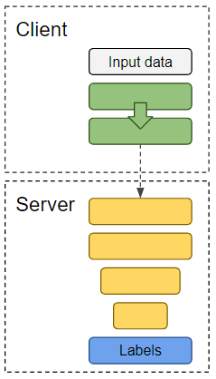

For forward propagation, the client runs its data through its layers and passes the final output to the server. The server takes this output and runs it through its private layers. For backward propagation, the server then calculates its gradients and sends it's private layer's gradients back to the client. The client finally updates its gradients and the training step is complete.

One improvement of split learning in terms of privacy is a variation that has no label sharing. This is useful because if the server has knowledge of the labels, then it can gain information about the various clients. For example, the server can infer the meaning of certain labels based on the distribution of labels. Furthermore, if the labels can be inferred, then the server can determine what types of data is present in each client's dataset. The setup required for split learning without label sharing is shown in the image below:

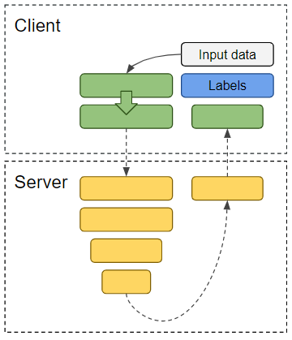

Essentially, just as the first few layers were on the client side, now the final layers are also on the client. This way, the pipeline looks U-shaped, with the client passing to the server and then back to the client for both forward and backward passes. This keeps the output labels private to the client, and it is the variation we will be discussing throughout this work.

For clarity, the steps for forward and backward propagation with split learning without label sharing are shown in the following image:

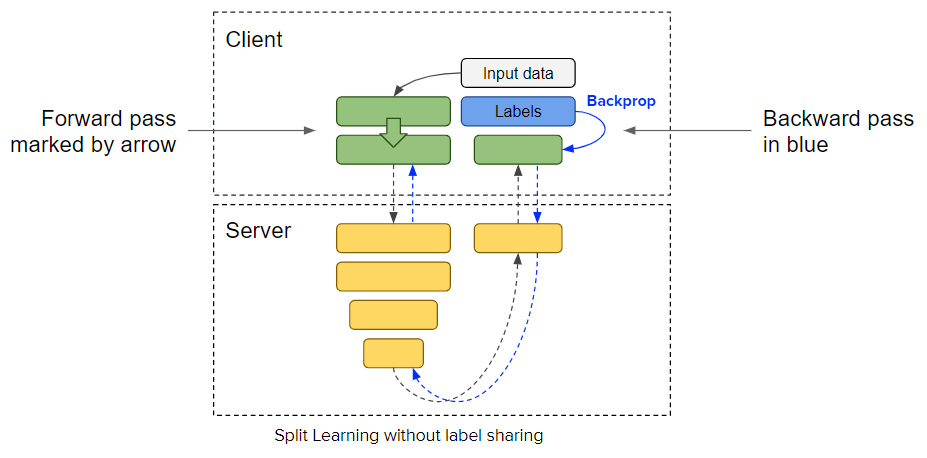

##### Benefits
The Split Learning setup claims to provide various benefits, both in terms of efficiency and privacy. Empirically, it is shown to have higher accuracies than other techniques like Federated Learning. At the same time, since only the final layer's outputs or gradients are transmitted between server and client, there is much less bandwidth required. Finally, client-side computation is reduced compared to other techniques since only some initial and final layers are computed (which tend to have fewer parameters than middle layers as well).

### C. Generative Adversarial Networks (GANs)

Generative Adversarial Networks (GANs) are generative models able to produce extremely high-quality data samples. In essence, they are made up of two networks playing a two-player minimax game. We have the Generator G, a network trying to create realistic-looking data. We also have the Discriminator D, which is trying to distinguish whether some input data is generated by G or from the original dataset that G is trying to replicate.

The two networks train off of each other, making each one better until at some point the Generator is creating extremely realistic-looking data and the Discriminator is a near-perfect classifier. The GAN setup has been used in many practical scenarios to generate images, videos, and many other such fake datasets that resemble real data.

## III. Motivation

### A. What we are doing

We are investigating the data privacy and model poisoning vulnerabilities for systems using the Split Learning paradigm to collaboratively train models. We are mounting a label poisoning attack on a class of the model that is kept private to us. For example, let us assume that a Split Learning model is being trained to predict MNIST digits and an attacker is training the model to increase the accuracy of the model on the '0' class. Let us assume that the attacker seeks to poison the '1' class of the model. We speculate three reasons why it is plausible for an attacker to target a particular class of the model, when they don't know the data behind that class:

1. They have deduced that a client they wish to attack may have the '1' class. In this case, the attacker does not know what data is present in the '1' class, however they wish to reduce the accuracy of the portion of the model that their targetted client is training.
2. Instead of focusing on a particular client, the attacker is trying to optimize the potency of their attack on the model over all classes. For example, perhaps the attacker realizes that there is an increased potency in their attack when they mislabel images from the '1' class as being from the '7' class, but a decreased potency when they mislabel images from the '8' class as the '7' class. There is therefore a better chance for their attack to work by choosing to poison the '1' class over the '8' class.
3. The attacker could have chosen this class arbitrarily. They could be trying to negatively impact the accuracy of any of the victim classes while preserving the accuracy of their own class.

### B. Why it is important

Split Learning has made specific claims [[9]](#9) that gives the training pipeline an extra edge in security over other collaborative training methods such as Federated Learning.

Their first claim is that the training data of disjoint clients cannot be accessed by one another, and a client's dataset is guaranteed to be secure regardless of the number of malicious clients present. This claim stems from the fact that the client's dataset never leaves their local system: the only information shared by the client's machine are the activations of the last client-side layer. The client-side layers introduce noise and perform nonlinear operations on the original input data. The information sent to the server is therefore not the client's raw data, but can be thought of as a cipher calculated by the client's private layers [[8]](#8). The cipher is weak because these client-side layers are shared amongst clients, which means that a maliscious client can recover the private data if they intercepted the victim client's transmission. However, since we are dealing with client-server communication, the transmission can be encrypted using public key encryption [[30]](#30). However, an attacker outside of the Split Learning process would not be able to derive the client's dataset regardless of encyption. Split Learning therefore easily mitigates snooping attacks and keeps all of the client's data private.

Their second claim is that malicious client attacks are mitigated since a portion of the shared model is off-limits to all clients. Zhang, Jiale, et al. [[3]](#3) showed that the private datasets of clients can be approximated when all clients have access to the model while it is training. Their work involved using a GAN to implement a label poisoning attack where the GAN's Discriminator model was replaced with the public model. By doing so, the GAN's generator was able to generate a convincing approximation of all classes that the attacker did not have access to. In order to mitigate this vulnerability, Split Learning keeps a portion of the model off-limits to the clients. This way, it is incredibly difficult to mount an attack using a GAN like before, because most of the model is now unkown to the attacker.

### C. How it is done today

No previous work has shown the vulnerabilities of Split Learning. Gupta et al. [[9]](#9) mention their future work will be to investigate vulnerable aspects of Split Learning. We have performed this work in order to help in the investigation. Because no prior work has mounted an attack on Split Learning, we extend present state-of-the-art methods to perform an attack. First, we simulate the Split Learning pipeline from [[9]](#9). Second, we incorporate the GAN attack from [[3]](#3). Finally, we improve our new pipeline with black-box attacks such as FGSM [[21-23]](#21) and advGAN [[20]](#20). We decided to test the aspects of these two methods in particular by comparing the performance of different black-box attack attempts on the MNIST dataset in the MIT _MNIST Adversarial Examples Challenge_ [[18]](#18).

### D. Specific Aims

In this work, we aim to accomplish the following five goals:

##### 1. Gather statistics for performing label poisoning attacks

In order to perform label poisoning on Split Learning, we must develop a testbed where we can strengthen our label poisoning attacks.

##### 2. Simulate the Split Learning method

To perform label poisoning on Split Learning, we also must simulate the Split Learning method. In order to shorten training times and have complete control over every step in the Split Learning method, we train the black-box model on the same machine as the client's GAN model. We require for our simulation to provide the ability to vary the number of clients and attackers.

##### 3. Approximate Split Learning’s black-box model

The server-side black-box model must be approximated as quickly and accurately as possible. However, the initial Discriminator is initialized with random weights and is very far from the black-box model. We require a system that will maximize the Generator's output success rate on the Discriminator and a black-box attack system that will query the black-box with images that cause the Discriminator to quickly approach the black-box.

##### 4. Evaluate vulnerability of Split Learning to a label poisoning attack

In order to mount a label poisoning attack on a Split Learning system using a GAN, we must first determine how feasible it is to conduct label poisoning on Split Learning using compromised clients. Our aim is to show that Split Learning can be poisoned using label poisoning via backdoors we create in our simulation.

##### 5. Evaluate vulnerability of Split Learning to a data estimation attack

Finally, we must implement the black-box and data estimation scheme in a coordinated label poisoning attack. In order to evaluate the vulnerability of Split Learning to this method, we will present both aggregated and individual attack results.

<!-- ## Technical Approach -->
## IV. Methods

### A. Label Poisoning Attack

The goal of the label poisoning attack is to poison the global classifier by performing a targeted flipping of one class to another. For example, we may have a digit classifier where we want all inputted 1's to be incorrectly classified as 7's.

The approach for this attack simple: feed in images of one input image class, but label it as a different output class. In the example above, we would feed in images of 1's into the system but label them as 7's. We would expect two possible outcomes of this attack, if successful. First, we would expect to flip the classification of one class to a new target class, which is the main purpose of this attack. In the example above, that is simply flipping 1's to be classified as 7's. But secondly, we would also expect this targeted label flipping to degrade the classifier accuracy of the *target class*. In the previous example, that would mean that the classification accuracy of 7's would also worsen. This is because the classifier's internal representation of a 7 would now contain both 1's and 7's.

One issue with a targeted label poisoning attack is that we assume that we have real data from the input class. In the previous example, we need actual images of 1's. In a truly private scenario, data from other clients' classes wouldn't easily be available. Therefore, if Split Learning's data privacy claims were true, we wouldn't be able to perform label flipping for any classes we didn't already have data for. However, if a client can get examples similar to an external class (such as a client with only 0's getting examples of 1's), then it would be possible to perform targeted label flipping. After implementing a GAN attack, we perform targeted label flipping using the GAN's generated images.

### B. GAN Poisoning Attack

In order to perform a label poisoning attack on a real Split Learning system, we require knowledge of the other clients' private datasets. For the following example, consider that an attacker represents 5% of the '0' class and desires to hinder the 100 clients responsible for training the '1' class.

The attacker will train the GAN while pretending to be a normal client, contributing to the training of the black-box model by performing backpropagation on their '0' dataset and sending the updated gradients to the server. The server accumulates clients on a timed schedule, resulting in 20 clients' gradient updates being accumulated every time using large batch synchronous SGD [[10]](#10).

As the attacker trains equitably, their GAN will learn features from the other clients’ private datasets. Once the attacker is satisfied with the convergence of their GAN on the '1' class, they will use the images generated from the Generator of the GAN in a label poisoning attack to reduce the accuracy for that class.

In order to accomplish this attack, we implement an 8-step training process. During this process the system is iteratively optimized by refining the Generator, querying the black-box, and refining the Discriminator.

<!-- Looking back: a potential mitigation is to have a strict schedule for accumulating batches between clients. ALTHOUGH, this could still be thwarted if the attacker had control of multiple clients. -->

##### The 8-step process

The above gif animates our 8-step process. This process is an extended version of the GAN poisoning attack performed by Zhang, Jiale, et al. [[3]](#3). We extend their method to account for querying the black-box model. The following steps are performed in order:

1. Pretend to be a normal client, training on the ‘0’ class.
2. Simultaneously train the Generator to produce fake data. Repeat steps 1 and 2 until there is no further improvement that can be made to the Generator. In other words, until the Discriminator consistently marks the images from the Generator as indistinguishable from fake images.
3. Use the optimized Generator to shuffle the fake data into the attacking client's normal training batch. This new batch of images is sent into the Split Learning model. The model returns the responses, and the labels from the fake data are removed and set aside.
4. Perform a normal backpropagation step on the remaining labels. The query that the attacker made goes undetected because the server receives the same training pattern as a benign client.
5. Generate a label from the Discriminator for each image generated by the Generator in step 3. The lables from the Discriminator are compared to the labels queried from the black-box. We use MSE to measure the difference between the labels. The Discriminator is refined to better match the black-box during future queries.
6. Repeat steps 1 through 5 until data from the targetted class emerges.
7. Send a batch of generated images into the Split Learning model.
8. Perform backpropagation on the batch sent to the Split Learning model. However, flip the labels accordingly to mount a label poisoning attack on the targetted class.

### C. GAN System Verification

Before commencing a full-blown GAN poisoning attack, we will first verify that we can produce private data from other clients, given the black-box is known to the attacker. We perform the same 8-step process as above; however, we clone the black-box model and use the clone as the Discriminator. The weights are shared throughout the training of the black-box. We know that if the GAN cannot generate valid attack images for all classes in the system when the black-box model is known to us, then it certainly cannot generate valid attack images when the black-box is kept secret.

### D. Black-box Attack

To improve the results of the GAN poisoning attack, we will query the black-box model with inputs designed to speed up Discriminator training. The Generator optimizes its output on the Discriminator. The Discriminator refines its output to match the black-box. However, the output from the black-box relies on the images provided by the Generator. Because of this recursive connection, the GAN training paradigm as-is presents a "Chicken and Egg" strategy problem. The training of this system converges very slowly because the Discriminator can only refine itself using _negative_ cases (in any other GAN training scheme, the Discriminator can use positive cases during training). 

Therefore, optimizing the Discriminator refinement process is congruent to optimizing the queries sent to the black-box. Black-box attack techniques provide this capability. We selected the two highest-performant techniques from MIT’s MNIST Adversarial Examples Challenge [[18]](#18), namely Fast Gradient Sign Method (FGSM) [[21-23]](#21) and advGAN [[20]](#20).

##### FGSM

The Fast Gradient Sign Method is a technique for perturbing an input image by using the gradients of the neural network. The image is first evaluated by the network, _O_, and then the gradients are found using the Jacobian, _J_. We implement two forms of FGSM using the L1 norm and Infinity norm. The L1 norm normalizes the gradients, whereas the Infinity norm takes the sign of them. The equation below implements the Infinity norm. This result is then multiplied by a factored called lambda and added to the original input.

The thinking behind the FGSM is that the gradients indicate the neural network's decision boundary for the input image. By adding a portion of the gradients to the input image, the resulting image approaches the decision boundary. Black-box attacks rely on querying the black-box with candidates that will help the attacker approximate the decision boundary of the black-box. We use FGSM for the same purpose: to speed up the refinement of the Discriminator.

##### advGAN

Adversarial GAN seeks to provide the same utility as FGSM, but by using a Generator to perturb the images instead of an operation of the gradients. See the figure below for the training scheme of advGAN.

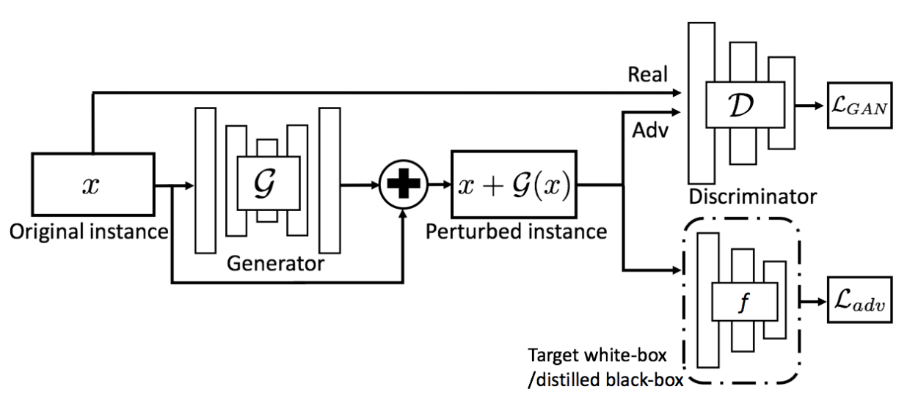

Since FGSM is proven to be as performant as advGAN [[31]](#31), in this work we try a new generative adversarial approach that we call uGAN. uGAN adds a second generator network that we call u-Generator to our pipeline. This network is connected to the same Discrimator, but uses an additional loss term. This term, highlighted in blue in the following figure, encourages the generator to generate images that the Discriminator is most confident in, regardless of then label it gives. The certainty measurement is obtained by measuring the categorical crossentropy between the original output of the Discriminator and a one-hot encoded output. If the Discriminator is certain of it's labeling, then the one-hot encoded output will be very close to the original output. This leads to a decrease in the crossentropy. By overfitting the u-Generator, it generates candidates that we hope will provide good queries for the black-box.

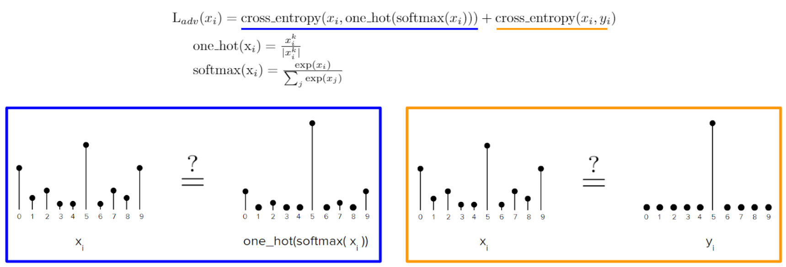

## V. Implementation

### A. Split Learning simulation

We used Tensorflow v2 with Keras to implement our Split Learning simulation. We used Tensorflow's eager execution framework to dynamically train multiple models simulataneously. We performed the simulation on a GTX 1080 GPU, with a machine that had 32 GB RAM. We trained on the MNIST digit dataset, which contains images of digits drawn in a 28x28 field. 1000 clients were split across the 10 types of digits, resulting in 100 clients per class. The server was hosted on the same machine and environment but in a separate model inaccessible to the client. The server accumulated clients at a rate so that 20 client gradients were accumulated before the Split Learning model was updated.

### B. Attack setup

We used the same hardware setup and client distribution to perform our attack as the Split Learning simulation. When performing label poisoning, we assumed we had control of clients with images labeled 0, and we were trying to flip 1’s to 7’s. The Discriminator shared the weights of the layers accessible to the client. The Discriminator received an identical layer layout as the black-box.

##### Discriminator complexity analysis

We decided to copy the structure of the black-box model for the Discriminator after an empirical analysis of the complexity requirements of the Discriminator. When running on the MNIST dataset, the black-box model can be successfully approximated by a Discriminator with much less complexity. We found that, after plotting Discriminator accuracy vs black-box during the Discriminator refinement, the Discriminator solely depends on the accuracy of the black-box. We show these results in the following plots of the Discriminator's accuracy and loss when the Discriminator was refined on the black-box using the MNIST training set using MSE. These results show that by deciding to copy the same structure of the black-box model, we are still over-estimating the Discriminator wrt to the black-box model.

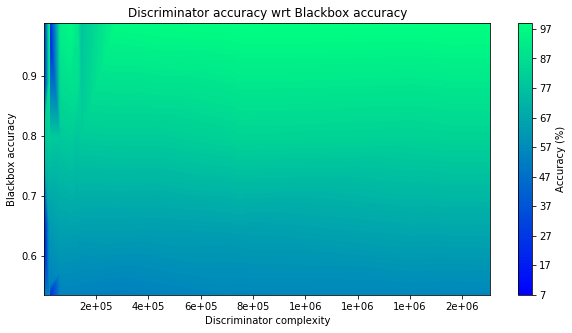
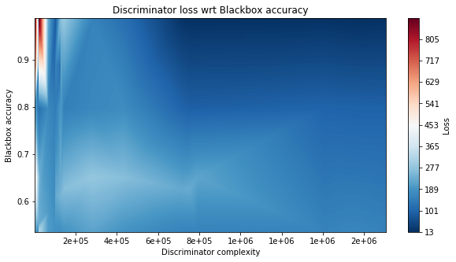

## VI. Experiments

We performed four experiments in turn. The completion of the preceding experiment was necessary to perform the one following. We define the success metrics for each experiment in their respective sections.

### A. Label Poisoning
First, we perform targeted label poisoning on a varying number of malicious input clients and observe the loss in accuracy with different amounts of poisoning. This shows the general vulnerability of the system to label poisoning, under the assumption that data from the input class we want to flip is known.

##### Success metrics

We will use the accuracy of the classifier on the entire test set to determine how much the poisoning is affecting the system accuracy as a whole.

Additionally, we look at the accuracy of the classifier on a modified dataset, in particular the original test set but with the labels flipped. This gives an idea of how successful the label poisoning is (not just in reducing system accuracy, but in the *targeted* flipping of labels).

### B. GAN System Verification

Once we are certain that the Split Learning model can be poisoned via label flipping, we will verify that the Generator in the GAN can successfully produce images that are indistinguishable to the black-box. To this end, the Discriminator in this experiment will be a clone of the black-box model.

##### Success metrics

We will use the accuracy of generated images on the black-box model to verify whether the Generator is producing valid results. The output of the Generator can also be compared to ground truth images from each class to measure the quality of the images produced. We do not require perfect results, however the results must indicate that the Generator is functioning correctly.

### C. GAN Black-box Attack

Once the GAN system has been verified, it can be inserted into the Split Learning pipeline and the 8-step process for commencing an attack can be performed. In this experiment, the Discriminator is a separate model from the black-box, however it has a duplicate layout as the black-box for the reasons mentioned in Section V.B. We train a GAN using clients from only a single class to approximate the private datasets from all other classes.

##### Success metrics

We will use the accuracy of generated images on the black-box model to measure the performance of the Generator. We will use the accuracy of the Discriminator on the original test set to measure how close the Discriminator is to the black-box model. We will also qualitively compare generated images of different estimation approaches. By using these three success metrics, we will determine if the GAN system can be used for label poisoning attacks.

### D. Label Poisoning using GAN Images

Once we are able to generate realistic images of other data classes, we attempt the standard label poisoning from Experiment A using the generated images. This will show us how feasible it is to perform a label flipping attack in a realistic split learning setup, end-to-end.

We vary two different things to see how well the data can be used to poison the system labels. Since we are poisoning the system as a whole while other non-malicious clients are also training, we need to see the effect that these other clients will have to our poisoning success.

First, we vary the availablity of non-malicious clients. What this means is that we try with all clients running at once, but we also see what happens when fewer clients are training during our poisoning. At the extreme, we see what happens when no other clients are training while our poisoning is happening.

Second, we see what happens when all clients are training but our malicious clients are flooding the system with label-flipped training requests. In particular, we vary the ratio of malicious to non-malicious training batches and see the effect this has on label-flipping capability.

##### Success metrics

Our success metric is determined by the accuracy of the system on two labels (our input label and the targeted label). In our example, this is the accuracy of classifying 1's and 7's. 

## VII. Results

### A. Label Poisoning

The following table shows the results of the label poisoning attack:

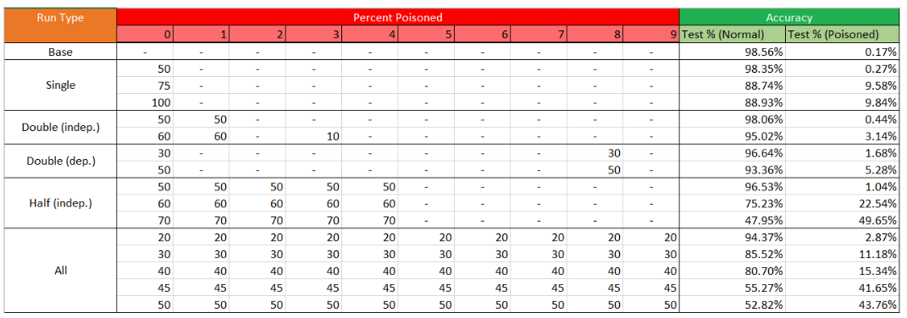

The "Percent Poisoned" columns indicate the percent of clients for each data class that are poisoning the system by label flipping. The test accuracy and the poisoned test accuracy indicate the two metrics mentioned in the previous section. Our baseline accuracy is 98.56% with no malicious clients.

The section with "Single" Run Type indicates what happens with a single malicious input target, with varying percentages of malicious clients. From this section, we can see that even with 50% of clients trying to flip 0's to 8's, we achieve a test accuracy comparable to the original accuracy. However, after 50% we see a noticeable drop in accuracy. This shows that the split learning system is relatively robust to label poisoning with few malicious clients.

In the "Double" section, we have two unrelated classes performing label poisoning. In the "Half" section, we have 5 unrelated classes. In each of these sections, we see that even with all these inputs having 50% poisoned clients, the system can still classify everything nearly perfectly.

In contrast, if we look at the "Double (dependent)" section, we see different results. What "dependent" here means is that the two poisoned classes are both trying to flip labels to the other class. For example, 0's are trying to flip their label to 8 while 8's are trying to flip their label to 0. In this case, we see a drop in accuracy even by 30% for two clients.

Once all 10 classes have clients attempting to poison the data (where 5 classes are each dependent on 5 others), we see that there is a much larger drop in accuracy. By 50% of all overall clients poisoning the system, we see about a 50% accuracy on each class. This corresponds to an equal probability of choosing either the correct label or the targeted label.

### B. GAN System Verification

The following graph shows the Generator's accuracy for generating images that the black-box considers valid. The accuracy flattens out early on, because the Generator finds a local minimum. To ensure that we reach a global minimum, if the accuracy from the GAN does not change after 10 epochs, we "nudge" the Generator by training the Discriminator with 20% probability for the following epoch and then resetting it back to its original weights before the nudge. Because the Discriminator is trained on the Generator's images, it is able to move from the local minimum it was in and into a lower local minimum. If the Generator's accuracy does not change, even after a nudge, then we stop training the Generator. These are the stop conditions we used to determine when the Generator was trained adequately.

The following image shows the output of the Generator for each digit counting up from 0 to 9. Although the digits are not perfect, the results show that the Generator has the potential to provide valid images for all of the private classes used in training.

### C. GAN Black-box Attack

After verifying the GAN system is capable of producing valid attack candidates when the black-box is known, we now keep it unknown to the attacker and use black-box attack techniques to approximate it.

During the experiment, the GAN was trained alongside the black-box attack. The success rate of the Generator was tracked by measuring how many of the generated images matched the label assigned by the black-box. The success rate of the Discriminator was tracked by measuring its accuracy on the MNIST test dataset. By comparing this accuracy to the accuracy of the black-box on the test set, we can measure how similar the Discriminator is to the black-box. Finally, we present the benefits of using black-box attack techniques by showing the generator output before and after the techniques were applied.

##### Generator success rate

The following figure shows a moving average of the Generator's accuracy on fooling the black-box for different black-box attack techniques. You can see that the only black-box attack technique that improved the Generator's success on fooling the black-box was FGSM when using the Infinity norm. A lambda of 0.5 was used for the FGSM methods. The FGSM using Infinity norm achieved 100% success after training for 40 iterations. The black-box was trained every other iteration, simulating a realistic scenario where the attackers don't have long before the black-box changes its decision boundaries.

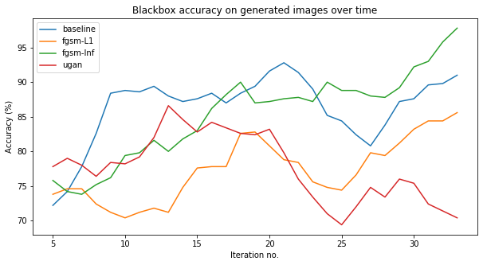

##### Discriminator success rate

The figure below shows the Discriminator's test accuracies for the different black-box attack techniques. The baseline, uGAN, and FGSM-L1 all diverge from the black-box test accuracy. It is evident why FGSM-Inf outperforms the others: it was able to preserve the Discriminator test accuracy during refinement. This best effort is still very far from the black-box test accuracy, shown in black. There is much room for improving this result and making the Discriminator better approach the black-box.

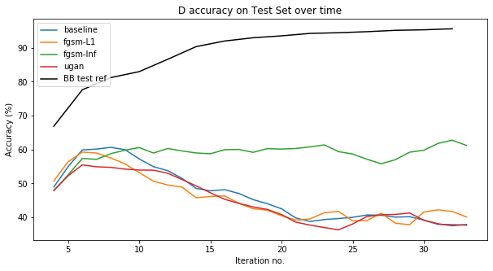

##### Black-box attack success rate

We show below the visual improvement made by FGSM when using the Infinity norm. First, observe the Generator's best output without FGSM. The digits are clouded with noise.

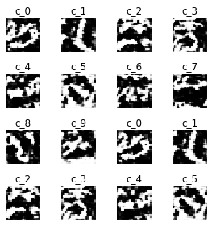

Compare this image to the Generator's best output when FGSM with Infinity norm is used. You can see that although the patterns are similar, the Generator is more confident in its generation when using FGSM with the Infinity norm. Note that, in both cases, the Generator was able to fool the black-box with 100% accuracy. The reason why the Discriminator test accuracy is closer to the black-box model is because FGSM-Inf reduced the noise of the Generator's output. 

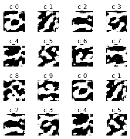

### D. Label Poisoning using GAN Images

The results for label poisoning with the GAN images assuming equal number of training batches for normal and malicious clients are shown below:

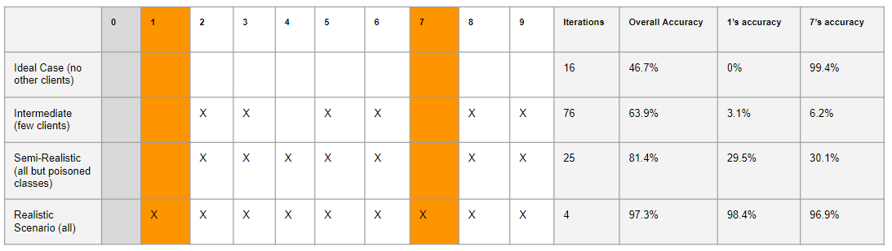

This table shows the effect of 1 and 7 classification accuracy with varying clients simultaneously training during the attack. We see that in the ideal scenario, where only the malicious client is training, the 1's and 7's are nearly perfectly misclassified.

In a realistic scenario, however, we would expect all other classes to be training as well, including the 1's and 7's we are trying to interrupt. In this case (shown in the table's last row), we see that the label poisoning attack fails.

However, when we remove just the 1's and 7's from training, we are immediately able to see the label poisoning working, as both 1's and 7's get about a 30% classification accuracy. This shows that the primary reason why label poisoning fails in this scenario is because the normal training steps of 1's and 7's mitigate the malicious training steps due to Split Learning's gradient averaging.

To make label poisoning more feasible in a realistic scenario, we kept the 1's and 7's also training alongside the other clients. However, we looked at the effect of increasing the number of attack batches compared to normal batches. This would correspond to the malicious clients flooding the system with training steps. For general label flipping (not specifically 1's and 7s', but all pairs of flipped labels), we got the results shown in the graph below:

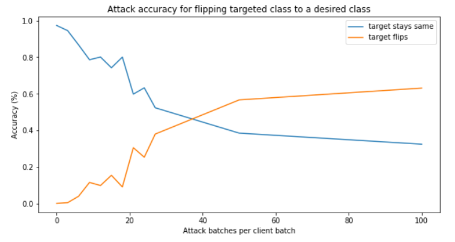

These results show that by around 40x the number of attack batches than regular batches, we are able to get about a 60% label flipping success rate. If we specifically look at just flipping 1's into 7's, we get the results below:

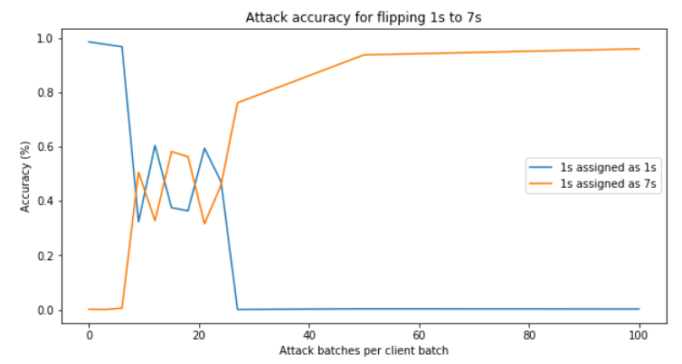

In this case, by around 50x the number of attack batches than regular batches, we are able to get perfect label flipping accuracy (assigning all 1's to 7's). This shows that by flooding the system with training steps using the GAN-generated images, we are able to successfully poison the labels doing a targeted label flipping attack.

## VIII. Key Findings

Overall, we were able to show that Split Learning has potential vulnerabilities and is not as private as its paper suggests. 

Split Learning is relatively difficult to attack with label poisoning techniques, as we need a majority of clients to be malicious to successfully carry out the technique. However, if we are able to flood the system with malicious training steps, then a Split Learning model can also be compromised.

Additionally, the FGSM + GAN setup we mentioned can be used to successfully estimate the server's private portion of the model. As a result, Split Learning's claim of partial model privacy also doesn't hold.

Finally, given that the blackbox model of the server can be estimated (which we have shown is possible), then a GAN can be used to estimate the data from unknown classes in a Split Learning system. This violates the privacy claims of Split Learning.

## IX. Related Work

### A. Inference attacks

With the growing reliance on neural network algorithms in many scientific and industrial fields, more and more researchers are sharing public neural network models.  However, in addition to the predictions the model producer aims to share, there is also a hidden risk that the model consumer can infer other properties of the training data which the model producer did not intend to share. Previous works have shown that by making a neural network model public, an adversary can extract information that was unintended for release, such as the environment in which the data was produced, or the fraction of the data that comes from a certain class [[27]](#27). Other works have shown that you can determine whether a particular input sample was used during a model's training period [[28]](#28), which presents serious and potentially hazardous repercussions if the input sample can be traced back to a particular individual through means such as composition attacks [[29]](#29).

### B. Federated learning

As we mentioned before, in federated learning there is a single central model on the server that is fully known to every client. During training, each client downloads the model and updates the weights according to its data. These client updates are then aggregated by the server. In this way, there is no raw data sharing. However, there is high memory bandwidth and computational requirement and it has no privacy guarantees [[1]](#1). This training method appears secure and very resilient to attacks on the surface, since the clients do not have access to other clients' datasets. However, it has been shown to be vulnerable to attacks that extract information from the shared central model [[2-3]](#2).

### C. Black-box attacks

The problem of querying black-box neural network models has been performed by many previous works. In these works the goal of the attacker is to minimize the number of times the black-box is queried in order to reduce the chance the attacker is detected.

Projected gradient descent methods have been used in adversarial machine learning to make perturbations to images that are indistinguishable to the naked eye but dramatically affect the targeted neural network's labeling of the perturbed image [[21]](#21). This technique moves the input vector in a direction that approaches and preferrably crosses one or more of the neural network's internal decision boundaries, confusing the network.

Since PGD functions seek out the decision boundary of a neural network, researchers have applied them in black-box attacks to better approximate the decision boundaries of the black-box they are querying. In this way, the Fast Gradient Sign Method has been used in multiple black-box attacks to strengthen their attack [[22-25]](#22).

## X. Future Work

One important direction of future work would be to investigate methods to prevent or mitigate our attacks on Split Learning inspired from previous mitigation methods [[16-17]](#16). While our results showed significant shortcomings in Split Learning systems, these may not be realistic considerations if malicious clients can be successfully detected early on.

One other direction to look into would be to extend our results to more complex datasets like CIFAR-100 or the AT&T dataset. This would give an idea of how well this technique would extend to more generic split learning setups rather than our proof-of-concept MNIST results.

We can also apply our FGSM + GAN pipeline to a federated learning system to reduce the likelihood of a GAN-based attack being detected. Using FGSM significantly improved our results, so we expect it might do the same for Federated Learning (by which many of our attacks were inspired).

The scale factor, lambda, in our FGSM methods was set to 0.5 arbitrarily since we achieved decent results early on in our development at this value. However, this value could be optimized either through an exhaustivive search or by making it a trainable variable in the Generator model.

The **e**lastic-net **a**ttack to **d**eep neural networks (EAD) generates transferable adversarial examples which, have high Infinity-norm distortion, and yet have minimal visual distortion [[26]](#26). This new attack maximizes the Infinity-norm distortion, which may outperform FGSM in this case since FGSM-Inf had the best performance over all of the black-box methods we attempted.

Experiment D evaluated the performance our single label poisoning attack. We did not present results for a coordinated label poisoning attack, which from Experiment A was shown to be more effective. In the future we can refine our attack by performing more coordinated label flipping.

## XI. Citations

##### Vulnerabilities of Federated Learning

<ol>
    <li id="1">
    Kairouz, Peter, et al. "Advances and open problems in federated learning." arXiv preprint arXiv:1912.04977 (2019).
    </li>
    <li id="2">
    Bhagoji, Arjun Nitin, et al. "Analyzing federated learning through an adversarial lens." arXiv preprint arXiv:1811.12470 (2018).
    </li>
</ol>

##### Label Poisoning Attacks

<ol start="3">
    <li id="3">
    Zhang, Jiale, et al. "Poisoning Attack in Federated Learning using Generative Adversarial Nets." 2019 18th IEEE International Conference On Trust, Security And Privacy In Computing And Communications/13th IEEE International Conference On Big Data Science And Engineering (TrustCom/BigDataSE). IEEE, 2019.
    </li>
    <li id="4">
    Biggio, Battista, Blaine Nelson, and Pavel Laskov. "Poisoning attacks against support vector machines." arXiv preprint arXiv:1206.6389 (2012).
    </li>
    <li id="5">
    Huang, Ling, et al. "Adversarial machine learning." Proceedings of the 4th ACM workshop on Security and artificial intelligence. 2011.
    </li>
</ol>

##### Backdoor Attacks

<ol start="6">
    <li id="6">
    Chen, Xinyun, et al. "Targeted backdoor attacks on deep learning systems using data poisoning." arXiv preprint arXiv:1712.05526 (2017).
    </li>
    <li id="7">
    Bagdasaryan, Eugene, et al. "How to backdoor federated learning." arXiv preprint arXiv:1807.00459 (2018).
    </li>
</ol>

##### Split Learning Method

<ol start="8">
    <li id="8">
    Vepakomma, Praneeth, et al. "Split learning for health: Distributed deep learning without sharing raw patient data." arXiv preprint arXiv:1812.00564 (2018).
    </li>
    <li id="9">
    Gupta, Otkrist, and Ramesh Raskar. "Distributed learning of deep neural network over multiple agents." Journal of Network and Computer Applications 116 (2018): 1-8.
    </li>
    <li id="10">
    Vepakomma, Praneeth, et al. "No Peek: A Survey of private distributed deep learning." arXiv preprint arXiv:1812.03288 (2018).
    </li>
    <li id="11">
    Vepakomma, Praneeth, et al. "Reducing leakage in distributed deep learning for sensitive health data." arXiv preprint arXiv:1812.00564 (2019).
    </li>
    <li id="12">
    Singh, Abhishek, et al. "Detailed comparison of communication efficiency of split learning and federated learning." arXiv preprint arXiv:1909.09145 (2019).
    </li>
    <li id="13">
    Sharma, Vivek, et al. "ExpertMatcher: Automating ML Model Selection for Users in Resource Constrained Countries." arXiv preprint arXiv:1910.02312 (2019).
    </li>
    <li id="14">
    Sharma, Vivek, et al. "ExpertMatcher: Automating ML Model Selection for Clients using Hidden Representations." arXiv preprint arXiv:1910.03731 (2019).
    </li>
    <li id="15">
    Poirot, Maarten G., et al. "Split Learning for collaborative deep learning in healthcare." arXiv preprint arXiv:1912.12115 (2019).
    </li>
</ol>

##### Attacker Detection and Mitigation

<ol start="16">
    <li id="16">
    Chen, Huili, et al. "Deepinspect: A black-box trojan detection and mitigation framework for deep neural networks." Proceedings of the 28th International Joint Conference on Artificial Intelligence. AAAI Press. 2019.
    </li>
    <li id="17">
    Fung, Clement, Chris JM Yoon, and Ivan Beschastnikh. "Mitigating sybils in federated learning poisoning." arXiv preprint arXiv:1808.04866 (2018).
    </li>
</ol>

##### Black-box model attacks
<ol start="18">
    <li id="18">
    https://github.com/MadryLab/mnist_challenge#black-box-leaderboard-original-challenge
    </li>
    <li id="19">
    Ilyas, Andrew, et al. "Black-box adversarial attacks with limited queries and information." arXiv preprint arXiv:1804.08598 (2018).
    </li>
    <li id="20">
    Xiao, Chaowei, et al. "Generating adversarial examples with adversarial networks." arXiv preprint arXiv:1801.02610 (2018).
    </li>
</ol>

##### PGD-based black-box attacks
<ol start="21">
    <li id="21">
    Madry, Aleksander, et al. "Towards deep learning models resistant to adversarial attacks." arXiv preprint arXiv:1706.06083 (2017).
    </li>
    <li id="22">
    Goodfellow, Ian J., Jonathon Shlens, and Christian Szegedy. "Explaining and harnessing adversarial examples." arXiv preprint arXiv:1412.6572 (2014).
    </li>
    <li id="23">
    Papernot, Nicolas, et al. "Practical black-box attacks against machine learning." Proceedings of the 2017 ACM on Asia conference on computer and communications security. 2017.
    </li>
    <li id="24">
    Milton, Md Ashraful Alam. "Evaluation of Momentum Diverse Input Iterative Fast Gradient Sign Method (M-DI2-FGSM) Based Attack Method on MCS 2018 Adversarial Attacks on Black Box Face Recognition System." arXiv preprint arXiv:1806.08970 (2018).
    </li>
    <li id="25">
    Tramèr, Florian, et al. "Ensemble adversarial training: Attacks and defenses." arXiv preprint arXiv:1705.07204 (2017).
    </li>
</ol>

##### EAD method
<ol start="26">
    <li id="26">
    Sharma, Yash, and Pin-Yu Chen. "Attacking the Madry Defense Model with $ L_1 $-based Adversarial Examples." arXiv preprint arXiv:1710.10733 (2017).
    </li>
</ol>

##### Inferfence and privacy attacks
<ol start="27">
    <li id="27">
    Ganju, Karan, et al. "Property inference attacks on fully connected neural networks using permutation invariant representations." Proceedings of the 2018 ACM SIGSAC Conference on Computer and Communications Security. 2018.
    </li>
    <li id="28">
    Shokri, Reza, et al. "Membership inference attacks against machine learning models." 2017 IEEE Symposium on Security and Privacy (SP). IEEE, 2017.
    </li>
    <li id="29">
    Ganta, Srivatsava Ranjit, Shiva Prasad Kasiviswanathan, and Adam Smith. "Composition attacks and auxiliary information in data privacy." Proceedings of the 14th ACM SIGKDD international conference on Knowledge discovery and data mining. 2008.
    </li>
</ol>

##### Public key encryption
<ol start="30">
    <li id="30">
    Canetti, Ran, Shai Halevi, and Jonathan Katz. "A forward-secure public-key encryption scheme." International Conference on the Theory and Applications of Cryptographic Techniques. Springer, Berlin, Heidelberg, 2003.
    </li>
    <li id="31">
    Li, Chaoran, et al. "Man-in-the-Middle Attacks against Machine Learning Classifiers via Malicious Generative Models." arXiv preprint arXiv:1910.06838 (2019).
    </li>
</ol>
